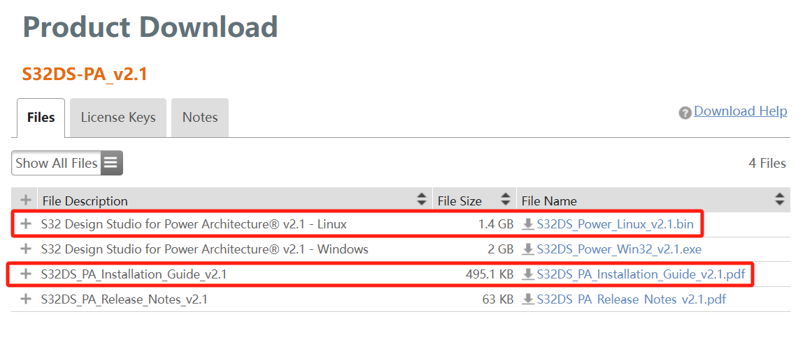
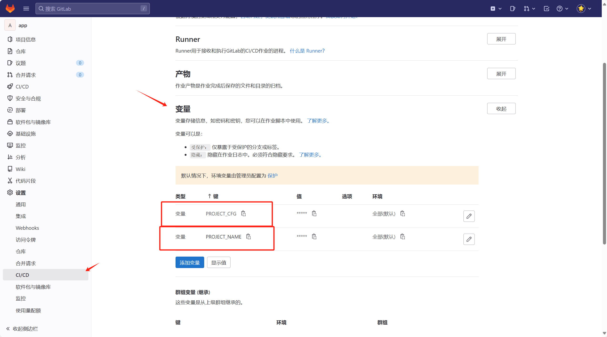
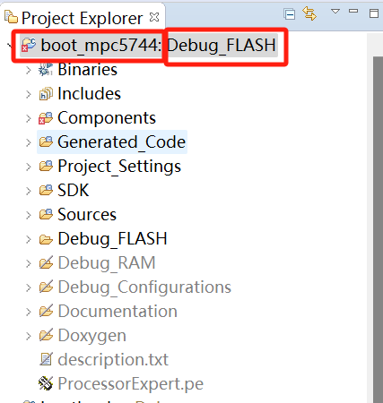
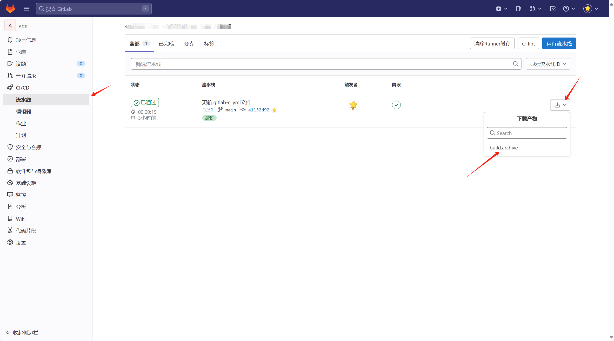

该文档通过gitlab-runner搭建nxp mpc5744自动构建功能。

# 编译环境搭建

- **编译方案**


nxp s32ds 基于eclipse二次开发，所以无论是S32 Design Studio for Power Architecture Version 2(后面简称上s32ds_pa_ide)还是其他架构版本的都是可以通过命令行对项目进行编译，为了方便在服务器上部署，所以**本方案选择将s32ds_pa_ide做成docker image**。

- **制作s32ds_pa_ide的docker image**

  > s32ds_pa_ide 目前只支持通过gui安装，无法通过命令行安装，参考[官方论坛的帖子](https://community.nxp.com/t5/S32-Design-Studio/How-to-install-S32DS-3-4-into-a-docker-image-command-line/m-p/1803876#M11843)可以将安装完成的s32ds_pa_ide打包后拷贝到docker image里。

  - 下载linux安装包并根据安装指导书在自己的虚拟机上完成ide安装

    

  - 将整个s32ds_pa_ide打包成压缩包S32DS_Power_v2.1.tar.gz，并上传服务器，与Dockerfile同级目录

    Dockerfile内容如下：

    ```dockerfile
    FROM ubuntu:16.04 as installer
    
    RUN dpkg --add-architecture i386 && apt-get update \
    && apt-get install -y \
        lib32z1 \
        libncurses5:i386 \
        libstdc++6:i386 \
        libbz2-1.0:i386 \
        libc6:i386 \
        libx11-6:i386 \
        libxpm4:i386 \
        openjdk-8-jre \
        openjfx \
        libwebkitgtk-1.0-0 \
        tcl \
        libpython2.7:i386 \
        tofrodos \
        unzip \
        make \
    && rm -rf /var/lib/apt/lists/*
    
    WORKDIR /home/
    
    ADD S32DS_Power_v2.1.tar.gz .
    ```

  - 编译生成<span id="1">docker image</span>

    ```shell
    docker build -t s32ds_pa_ide .
    ```

# gitlab-ci搭建

## gitlab-runner创建和注册

在服务器上基于docker创建一个gitlab-runner容器，并且ci/cd执行器为docker

- 获取gitlab-runner register 的url、token


- 根据自己的要求修改/etc/gitlab-runner挂载到宿主机的路径，并修改url、token后执行

  >  其中  --executor "docker"   --docker-image s32ds_pa_ide:latest  根据[编译环境搭建](#1)最终生成的image修改

```shell
#! /bin/bash

docker run -d --net host --name mpc5744-runner --restart always \
     -v /home/project/gitlab-runner/config:/etc/gitlab-runner \
     -v /var/run/docker.sock:/var/run/docker.sock \
     gitlab/gitlab-runner:latest

docker run -it --rm -v /home/wumingxu/project/can2io/gitlab-runner/config:/etc/gitlab-runner gitlab/gitlab-runner register \
  --non-interactive \
  --executor "docker" \
  --docker-privileged \
  --docker-image s32ds_pa_ide:latest \
  --url "xxxxxx" \
  --registration-token "xxxxxxx" \
  --description "build-runner" \
  --tag-list "build" \
  --run-untagged="true" \
  --locked="false" \
  --access-level="not_protected"
```

- 成功后可在gitlab对应位置看到注册的runner

- 修改/home/project/gitlab-runner/config/config.toml，默认镜像拉取策略always，总是通过docker register拉取，由于我们的镜像是在本地制作，所以修改镜像拉取策略，将 pull_policy = ["if-not-present"]加到 [runners.docker]下面

  ```shell
  [[runners]]
    name = "build-runner"
    url = "xxxx"
    id = 7
    token = "xxxxxx"
    token_obtained_at = 2024-04-09T01:42:55Z
    token_expires_at = 0001-01-01T00:00:00Z
    executor = "docker"
    [runners.cache]
      MaxUploadedArchiveSize = 0
    [runners.docker]
      pull_policy = ["if-not-present"]
      tls_verify = false
      image = "s32ds_pa_ide:latest"
      privileged = true
      disable_entrypoint_overwrite = false
      oom_kill_disable = false
      disable_cache = false
      volumes = ["/cache"]
      shm_size = 0
      network_mtu = 0
  ```

  

## .gitlab-ci.yml编写

- 在项目添加以下.gitlab-ci.yml文件，其中$PROJECT_CFG、$PROJECT_NAME通过gitlab ci/cd 变量设定

  > 关于.gitlab-ci.yml语法见[官方手册](https://docs.gitlab.cn/jh/ci/yaml/)
  > 
  > image关键字指定所在job是基于我们自己编译的s32ds_pa_ide docker image执行的
  > 
  > script调用的编译命令用法参考该链接[Building Projects with Eclipse from the Command Line | MCU on Eclipse](https://mcuoneclipse.com/2014/09/12/building-projects-with-eclipse-from-the-command-line/)

```yaml
stages:
  - build


build: # 编译阶段
  stage: build
  only:
    - main
  tags:
    - build
  image: 
    name: s32ds_pa_ide
    pull_policy: if-not-present
  script:
    - /home/S32DS_Power_v2.1/eclipse/s32ds -nosplash -application org.eclipse.cdt.managedbuilder.core.headlessbuild -import ./ -cleanBuild "$PROJECT_NAME/$PROJECT_CFG" --launcher.ini /home/S32DS_Power_v2.1/eclipse/s32ds.ini --launcher.suppressErrors
  artifacts: 
    paths: 
     - $PROJECT_CFG/$PROJECT_NAME.elf
     - $PROJECT_CFG/$PROJECT_NAME.srec
  
```

- gitlab ci/cd 变量设定取决于s32ds ide里具体的工程名及配置

  



PROJECT_NAME  对应  boot_mpc5744

PROJECT_CFG  对应  Debug_FLASH

- 下载编译产物

  